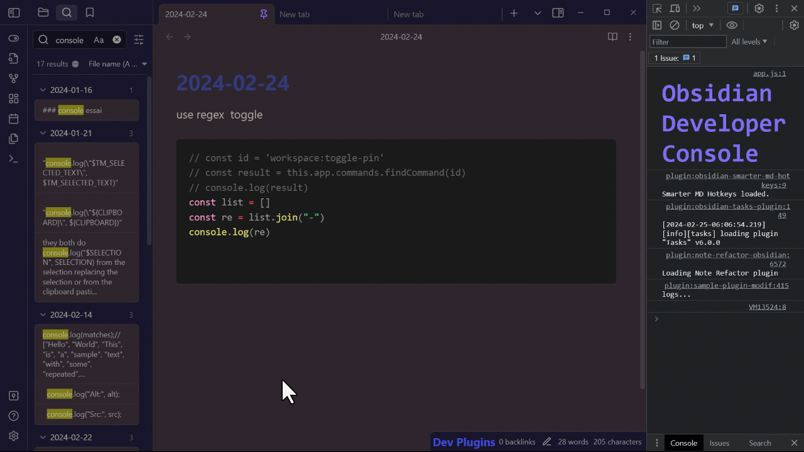
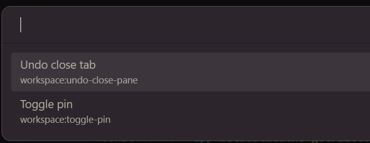
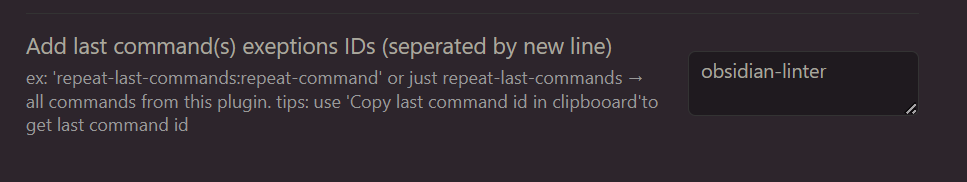

# Repeat Last Command(s)

New: hide commands and show them again  
  

[demo](https://youtu.be/7-_vkC7-K9g)

- repeat last command (suggestion: Ctrl Shift P)  
setting: notify what command was

- repeat last commands (suggestion: Ctrl Alt P)  
setting: max of commands to show in settings

- toggle pinned commands pressing TAB

- add Aliases to your commands pressing ALT   

- last commands at top of the command palette (settings option)  

- prevent some commands to be included in last command(s), in settings filling the textarea in settings. 1 by line. 
You can give a whole command. e.g: 'repeat-last-commands:repeat-command'  
or just 'repeat-last-commands' to block all commands from this plugin.

- for devs, you can run "copy last command id in clipboard". id is appearing in repeat last commands too.